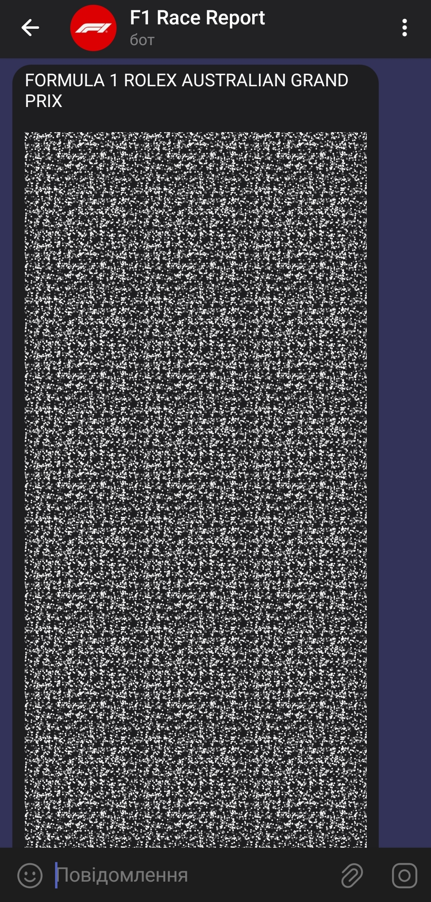
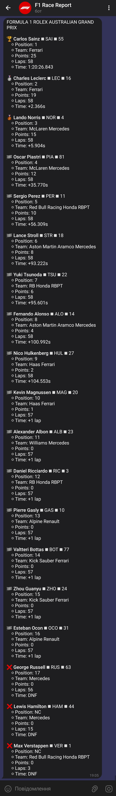
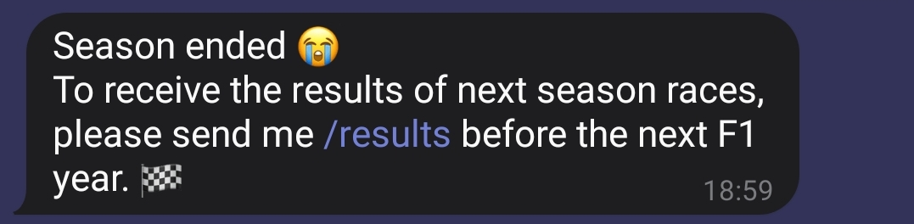

# F1-race-report-telegram-bot

### **Formula 1 Race Results Bot**

This Telegram bot keeps you updated with the latest Formula 1 race results.
It automatically fetches official race result links from the Formula 1 website,
retrieves race data including date and name,
and sends updates to your Telegram chat when new race results are available.
You can stay informed about each race's winner, positions, teams, points, laps, and race time.

### **Work logic**
1. Fetching Race Links: The bot fetches official Formula 1 race result links from the Formula 1 website. 
These links contain information about all races of the current season.

2. The bot periodically checks if the race data needs to be updated. 
If the race data is outdated or missing, 
it fetches new race information from the web and stores it locally in a JSON file.

3. When new race results are available, the bot sends updates to Telegram chat groups or individual users. 
These updates include details such as the race winner, positions, teams, points, laps, and race time.

4. Once the Formula 1 season ends, the bot sends a message notifying users that the season has ended. 
It also prompts users to subscribe to updates for the next season.

### **Screenshot examples**

1. Returned result under the spoiler — this is how user sees the race results at the first time:

2. What results look like when we open the spoiler:

3. When the season ended, user receives the message like: 

